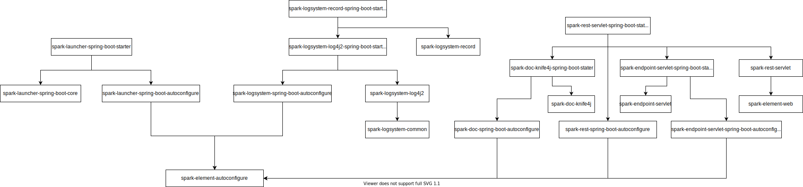

## 简介

基于 Spring Boot 自动装配原理封装的简化业务开发的 starter 组件, 强化依赖管理与组件化开发.

## 结构说明

```
.
├── spark-agent                                       # 业务中台相关组件
│   ├── spark-agent-adapter                           # 业务端使用的适配器
│   │   ├── spark-agent-feign-adapter                 # 基于 feign 的适配器
│   │   └── spark-agent-rest-adapter                  # 基于 restTemplate 的适配器
│   ├── spark-agent-basic                             # 基础组件
│   └── spark-agent-spring-boot                       # agent service 组件
├── spark-boot-dependencies                           # starter 组件依赖封装
├── spark-boot-dependencies-v4                        # v4 使用的依赖封装
├── spark-cache-spring-boot                           # 多级缓存组件
├── spark-captcha-spring-boot                         # 验证码组件
│   ├── spark-captcha-spring-boot-core
│   │   ├── spark-captcha-common                      # 公共代码
│   │   ├── spark-captcha-graph                       # 图形验证码
│   │   └── spark-captcha-sms                         # 短信验证码
│   └── spark-captcha-spring-boot-starter
├── spark-cloud-spring-boot                           # Spring Cloud 封装
│   ├── spark-cloud-spring-boot-core
│   │   ├── spark-cloud-nacos                         # nacos 组件
│   │   ├── spark-cloud-seata                         # seata 组件
│   │   └── spark-cloud-sentinel                      # sentinel 组件
├── spark-dingtalk-spring-boot                        # 钉钉组件
├── spark-doc-spring-boot                             # API 接口文档
│   └── spark-doc-spring-boot-core
│       ├── spark-doc-agent                           # agent service 接口文档
│       ├── spark-doc-common
│       ├── spark-doc-dubbo                           # dubbo service 接口文档
│       ├── spark-doc-knife4j                         # rest service 接口文档
│       ├── spark-doc-restdoc                         # restdoc 接口文档 (spring 提供的, 暂未完成)
│       └── spark-doc-swagger                         # swagger 插件扩展
├── spark-dubbo-spring-boot                           # dubbo 组件
├── spark-email-spring-boot                           # 邮件组件
├── spark-endpoint-spring-boot                        # 自定义 endpoint 组件
├── spark-enhance-starter                             # starter 组件聚合
│   ├── spark-agent-sdk-parent                        # 给 SDK 使用的 parent, 可减少依赖
│   ├── spark-asm-spring-boot-starter                 # framework + agent + mybatis
│   ├── spark-facade-spring-boot-starter              # framework = rest + knife4j
│   ├── spark-framework-starter                       # launcher + logsystem
│   ├── spark-mservice-spring-boot-starter            # framework + cloud + dubbo
│   ├── spark-ssm-spring-boot-starter                 # framework + facade + mybatis
│   └── spark-state-spring-boot-starter               # framework + state
├── spark-es-spring-boot                              # 全文检索
├── spark-eventbus-spring-boot                        # envent bus
├── spark-feign                                       # 在 agent 之前实现的业务端请求组件 (目前已使用 agent 代替)
├── spark-id-spring-boot                              # 分布式 id 生成组件
│   └── spark-id-spring-boot-core
│       └── db                                      # 基于数据库生成 id 的 DDL
├── spark-idempotent-spring-boot                      # 幂等组件
├── spark-ip2region-spring-boot                       # ip 转为地理位置
├── spark-launcher-spring-boot                        # 启动器
├── spark-logsystem-spring-boot                       # 日志系统 (不是日志中心)
│   ├── spark-logsystem-spring-boot-core
│   │   ├── spark-logsystem-common                    # 基础吧, 会被 logsystem 所有米快适应
│   │   ├── spark-logsystem-log4j2                    # log4j2 日志系统
│   │   ├── spark-logsystem-record                    # 审计日志记录
│   │   └── spark-logsystem-simple                    # 金丹的 log 实现
├── spark-metrics-spring-boot                         # 度量指标
│   ├── spark-metrics-spring-boot-autoconfigure
│   ├── spark-metrics-spring-boot-core
│   │   ├── spark-metrics-hippo4j-spring-boot-core    # 动态线程池
│   │   ├── spark-metrics-moss-spring-boot-core       # moss 集成
│   │   └── spark-metrics-skywalking-spring-boot-core # skywalking 集成
├── spark-mongo-spring-boot                           # mongo 组件
├── spark-mq-spring-boot                              # MQ 组件
│   ├── spark-mq-spring-boot-core
│   │   ├── spark-mq-common                           # 公共类
│   │   ├── spark-mq-kafka                            # kafka 及合成
│   │   └── spark-mq-rocket                           # RocketMQ 阶层
├── spark-mqtt-spring-boot                            # MQTT 组件
├── spark-mybatis-spring-boot                         # mybatis plus + druid
├── spark-openness-spring-boot                        # 开放接口组件
├── spark-pay-spring-boot                             # 支付通用组件
├── spark-qrcode-spring-boot                          # 二维码生成
├── spark-rest-spring-boot                            # RESTFul 组件
│   ├── spark-rest-spring-boot-core
│   │   ├── spark-rest-common
│   │   ├── spark-rest-reactive                       # 响应式接口
│   │   └── spark-rest-servlet                        # 现在使用的 RESTFul 接口
├── spark-retry-spring-boot                           # 重试组件
├── spark-schedule-spring-boot                        # 分布式调度
├── spark-security-spring-boot                        # 安全组件
├── spark-sms-spring-boot                             # 短信组件
│   ├── spark-sms-spring-boot-core
│   │   ├── spark-sms-aliyun                          # 阿里云短信服务
│   │   ├── spark-sms-common                          # 公共代码
│   │   ├── spark-sms-qcloud                          # 腾讯短信服务
│   │   └── spark-sms-yimei                           # 亿美短信服务
├── spark-template-spring-boot                        # 组件开发模板
│   ├── spark-template-spring-boot-autoconfigure      # 自动装配模块
│   ├── spark-template-spring-boot-core               # 核心模块, 不使用自动装配模块也可以使用
│   └── spark-template-spring-boot-starter            # starter 依赖封装
├── spark-transaction-spring-boot                     # 分布式事务, 封装了 seata
├── spark-websocket-spring-boot                       # Websocket 组件
└── spark-zookeeper-spring-boot                       # Zookeeper 组件
```

## 依赖关系


