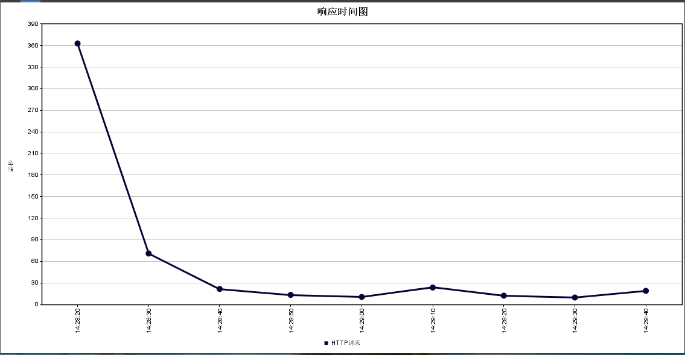
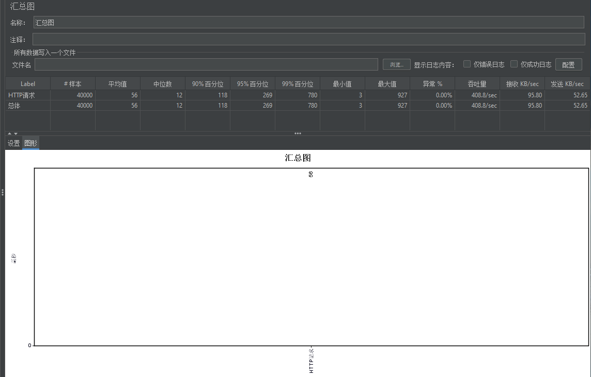

# Spark Agent Rest Adapter

## 项目简介

为了解决 V4 使用 Feign Client 依赖问题, 这里使用 RestTemplate 来消费 Agent 服务

注意: JDK 要求 1.7+

## 关键类说明

### 自动装配类

**AgentAdapterRestConfiguration:**

1. 装配 2 个 AOP;
2. 参数校验装配;
3. AgentTemplate 装配;
4. 请求拦截器装配;

### 注解

1. `AgentManager`: 标记 manager 层处理器的注解, 会自动将标记类注入到 IoC;
2. `Client`: 用于标注 SDK 中的客户端接口, 会在启动时扫描, 使用时通过生成代理类的方式进行远程调用;
3. `ServiceName`: 用于代替 `Client` 的 value 属性, 后面新的 SDK 否应该使用这种方式;
4. `Sdk` 用于标注 SDK 的客户端处理类, 会自动将标记类注入到 IoC, 且通过 AOP 自动写入 serviceName 属性;
5. `SdkOperation` 用于标记 SDK 的客户端处理类具体方法, 用于处理一个处理类中封装多个 Agent Service 接口, 需要明确 `apiServiceName` 属性;

### AOP

1. `SdkAnnotationAdvisor`: 处理 `Sdk` 注解, 并自动将 `Sdk` 的 `apiServiceName` 拼接到最终请求的 API 中;
2. `SdkOperationAnnotationAdvisor`: 处理 `SdkOperation` 注解, 优先级比 `SdkAnnotationAdvisor` 高;

### 请求拦截器

1. `ApplicationNameInterceptor`: 透传调用方的应用名;
2. `ClientHostInterceptor`: 透传调用方的 ip;
3. `ClientIdInterceptor`: 透传调用方的 clientId;
4. `SignatureInterceptor`: 参数签名;
5. `TenantIdInterceptor`: 透传 tenantId;
6. `TraceInterceptor`: 透传 trace 数据;

### 核心相关

1. `AgentClientsRegistrar`: 启动时注册所有的 Agent Client;
2. `AgentClientProxy`: 调用方最终使用动态代理的方式发起请求, 主要是透明的收集各种请求数据, 不需要业务方手动处理;
3. `AgentRequestBuilder`: 最终发起 HTTP 调用与结果处理的关键类;

## 项目结构

## 集成使用

## 配置说明

## 签名规则

## 注意事项

## 常见问题

## 后期计划

## 更新日志

### v1.8.0

#### 新特性

1. 使用 RestTemplate 原生请求，将原来的 Robbin 组件完全去除，不再有负载均衡策略，只配置一个地址。
2. yml 配置文件中可直接配置服务的 ip 地址，配置格式为 spark.gateway.xxx-center: 127.0.0.1:80。此配置优先度大于 @Client 中的 endpoint 中配置的 ip 地址

#### 修复 BUG

性能大幅度提升，在无相关业务的处理下，2000/s并发的平均值为56ms。

响应时间图:

汇总图:

