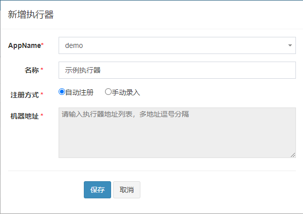
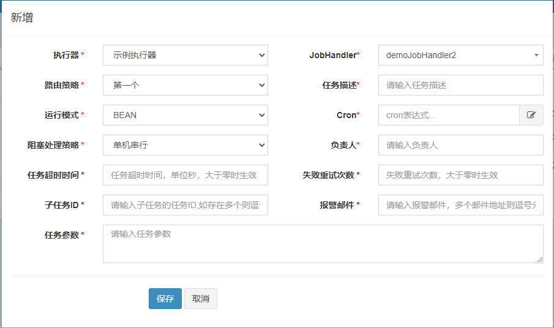
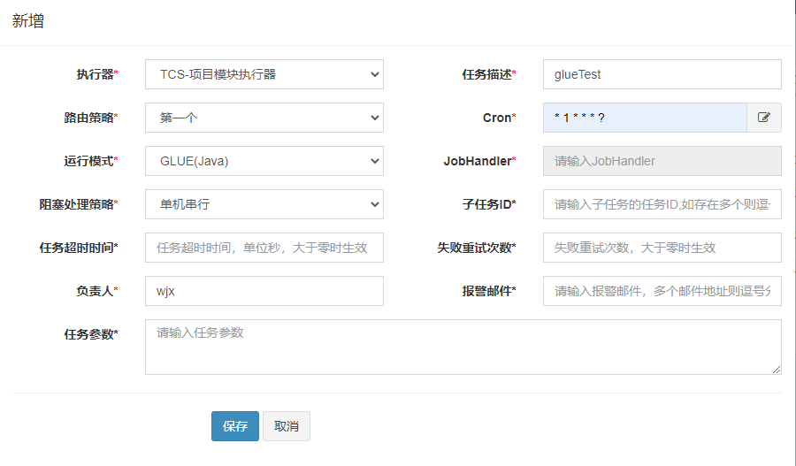
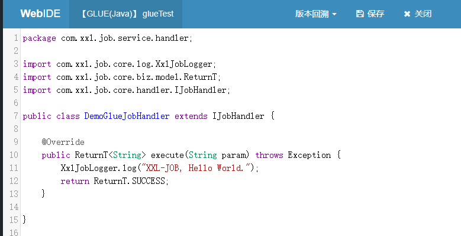

# Spark Schedule Starter

## 简介

定时任务调度组件.框架采用的是XXLJob, 选用此框架理由可查看[分布式任务调度选型](http://192.168.2.5/spark-docs/views/server/architecture/2019/08031846.html).
elastic-Job已经于2020年在[码云](https://gitee.com/elasticjob/elastic-job/tree/master)恢复更新。不过elastic-job的优势在于更大限度的利用分布式服务器的资源但学习成本大。而xxl-job这款轻量型款框架的文档非常丰富和详细，便于学习和使用，已经足以满足目前的需求。

## 功能特性

1. 简单：支持通过 Web 页面对任务进行 CRUD 操作，操作简单，一分钟上手，任务调度中心地址点击[这里](http://192.168.2.5:17070/schedule-admin)；
2. 动态：支持动态修改任务状态、启动 / 停止任务，以及终止运行中任务，即时生效；
3. 调度中心 HA (中心式)：调度采用中心式设计，“调度中心” 自研调度组件并支持集群部署，可保证调度中心 HA;
4. 执行器 HA (分布式)：任务分布式执行，任务 "执行器" 支持集群部署，可保证任务执行 HA;
5. 注册中心：执行器会周期性自动注册任务，调度中心将会自动发现注册的任务并触发执行。同时，也支持手动录入执行器地址；
6. 弹性扩容缩容：一旦有新执行器机器上线或者下线，下次调度时将会重新分配任务；
7. 路由策略：执行器集群部署时提供丰富的路由策略，包括：第一个、最后一个、轮询、随机、一致性 HASH、最不经常使用、最近最久未使用、故障转移、忙碌转移等；
8. 故障转移：任务路由策略选择 "故障转移" 情况下，如果执行器集群中某一台机器故障，将会自动 Failover 切换到一台正常的执行器发送调度请求。
9. 阻塞处理策略：调度过于密集执行器来不及处理时的处理策略，策略包括：单机串行 (默认)、丢弃后续调度、覆盖之前调度；
10. 事件触发：除了 "Cron 方式" 和 "任务依赖方式" 触发任务执行之外，支持基于事件的触发任务方式。调度中心提供触发任务单次执行的 API 服务，可根据业务事件灵活触发。
11. 任务进度监控：支持实时监控任务进度；
12. Rolling 实时日志：支持在线查看调度结果，并且支持以 Rolling 方式实时查看执行器输出的完整的执行日志

## 使用说明

1. 引入依赖

   ```xml
   <dependency>
       <groupId>info.spark</groupId>
       <artifactId>spark-schedule-spring-boot-starter</artifactId>
   </dependency>
   ```

2. 代码编写

   2.1.BEAN模式（类形式）

   ```java
   /** Job service */
   @Resource
   private JobService jobService;

   void addJob() {
       String result = this.jobService.add(new ScheduleAddDTO(2, "demo", "addJob", ""));
       log.info("{}", result);
    }
   ```
   2.2 BEAN模式（方法形式）

   ```java
   @Job(value = "demoJobHandler", init = "自定义初始化方法init", destroy = "自定义销毁方法destroy")
   public ReturnT<String> demoJobHandler2(String param) throws Exception {
       XxlJobLogger.log("XXL-JOB, Hello World.");
       return ReturnT.SUCCESS;
   }
   ```
   此处`@Job`注解中`value`的值需要与调度中心新建任务时填写的`JobHandler`值相同。通过`XxlJobLogger.log()`方法打印的日志可在调度中心页面的调度日志中直接查看。所以在调用业务逻辑方法的地方最好用`try-catch`
   包裹，然后将异常用`XxlJobLogger.log()`根据需求打印，因为此方法不会在本地文件生成日志，为了保证本地日志文件的完整性，最好也同样使用`log.error()`方法打印一份日志。

   所以建议按照以下格式来写：

   ```java
   @Job(value = "demoJobHandler")
public ReturnT<String> demoJobHandler2(String param)throws Exception{
    try{
    //业务逻辑...
    }catch(MyException e){
    log.error("定时任务异常: [{}]",e.getMessage());
    XxlJobLogger.log("定时任务异常: [{}]",e.getMessage());
    return ReturnT.FAIL;
    }
    return ReturnT.SUCCESS;
    }
   ```

2.3 配置说明

   ```yaml
   spark:
       schedule:
           # 定时任务开关
           enable: true
           # 调度中心部署跟地址 [选填]: 如调度中心集群部署存在多个地址则用逗号分隔. 执行器将会使用该地址进行"执行器心跳注册"和"任务结果回调"; 为空则关闭自动注册
           admin-addresses: http://192.168.2.5:17070/schedule-admin
           # 执行器通讯TOKEN [选填]: 非空时启用;
           accessToken: ""
           # 执行器通讯TOKEN [选填]: 非空时启用;
           executor:
               # 执行器AppName [选填]: 执行器心跳注册分组依据; 为空则关闭自动注册
               appName: demo
               # 执行器IP [选填]: 默认为空表示自动获取IP, 多网卡时可手动设置指定IP, 该IP不会绑定Host仅作为通讯实用; 地址信息用于 "执行器注册" 和 "调度中心请求并触发任务"
               ip: 127.0.0.1
               # 执行器运行日志文件存储磁盘路径 [选填]: 需要对该路径拥有读写权限; 为空则使用默认路径
               logPath: ""
               # 执行器日志文件保存天数 [选填]: 过期日志自动清理, 限制值大于等于3时生效; 否则, 如-1, 关闭自动清理功能
               logRetentionDays: 7
               # 执行器端口号 [选填]: 小于等于0则自动获取; 默认端口为9999, 单机部署多个执行器时, 注意要配置不同执行器端口
               port: 9997
   ```

3. 任务调度中心

   3.1添加执行器



在`执行器管理-新增`中添加，一个项目添加一个执行器即可。此处的`AppName`需要与配置文件的`appName`的值相同，如果勾选自动注册则不用填写机器地址，如果是手动录入则需要填写在配置文件`ip`处填写的地址。

3.2添加定时任务



在`任务管理`选择我们刚刚创建的`执行器`，然后点击`新增`。每个方法对应一个任务， `JobHandler`处填写的内容与代码中`@Job`注解中`value`的值相同。如果是已经写好代码并启动过项目，在配置无误的情况，点击`JobHandler`
会有下拉框显示我们写好的定时任务方法供我们选择。任务参数一栏填写的任务参数，会被定时任务方法接收，视自己的需求而定是否填写。

3.3GLUE模式 这是一个比较酷的方式。我们可以直接在线编辑代码，任务以源码方式维护在调度中心，支持通过Web
IDE在线更新，实时编译和生效，因此不需要指定JobHandler。我们在项目上线后临时实现一个小功能亦或在线debug看看部分缓存或者静态数据的话可以考虑通过这种方式来做。 在3.2中新建任务时在运行模式出选择`GLUE(Java)`


保存后在新增的任务操作栏里点击`GLUE IDE`, 在弹出的页面直接编写代码或者脚本，每次编辑都会保存一个副本，通过`版本回溯`还可有简单的版本控制效果.此方式支持编写`JAVA`,`python`,`nodejs`,`shell`,`php`,`powershell`.



建议在`idea`编辑好代码测试完成后再放上去，习惯在集成式开发环境开发的我们在这种文本编辑器写代码或许会犯一些刚学代码的错误，比如导包，字母大小写，写错调用的类名或者方法单词等。~~不要问我怎么知道的。~~

4.Bean模式和GLUE模式原理说明

每个`Bean`模式任务都是一个Spring的Bean类实例，它被维护在`执行器`项目的Spring容器中。任务类需要继承统一接口`IJobHandler`，任务逻辑在execute方法中开发，因为`执行器`在接收到调度中心的调度请求时，将会调用`IJobHandler`
的execute方法，执行任务逻辑。 每个 `GLUE(Java)` 模式任务的代码，实际上是`一个继承自`IJobHandler`的实现类的类代码`，`执行器`接收到`调度中心`
的调度请求时，会通过Groovy类加载器加载此代码，实例化成Java对象，同时注入此代码中声明的Spring服务（需确保Glue代码中的服务和类引用在`执行器`项目中存在），然后调用该对象的execute方法，执行任务逻辑。

## ScheduleAddDTO说明

```java
/** 执行器主键ID */
private Integer jobGroup;
/** 任务执行CRON表达式 */
private String jobCron;
/** Job desc */
private String jobDesc;
/** 负责人 */
private String author;
/** 报警邮件 */
private String alarmEmail;
/** 执行器路由策略 */
private String executorRouteStrategy;
/** 执行器, 任务Handler名称 */
private String executorHandler;
/** 执行器, 任务参数 */
private String executorParam;
/** 阻塞处理策略 */
private String executorBlockStrategy;
/** 任务执行超时时间, 单位秒 */
private Integer executorTimeout;
/** 失败重试次数 */
private Integer executorFailRetryCount;
/** GLUE 类型 com.xxl.job.core.glue.GlueTypeEnum */
private String glueType;
/** 子任务ID, 多个逗号分隔 */
private String childJobId;

/**
 * Schedule add dto
 *
 * @param jobGroup      job group
 * @param author        author
 * @param jobDesc       job desc
 * @param executorParam executor param
 * @since 1.4.0
 */
public ScheduleAddDTO(Integer jobGroup,String author,String jobDesc,String executorParam){
    this.jobGroup=jobGroup;
    this.author=author;
    this.jobDesc=jobDesc;
    this.executorParam=executorParam;
    this.jobCron="* * * 1/1 * ?";
    this.executorRouteStrategy=ExecutorRouteStrategyEnum.RANDOM.name();
    this.executorHandler="checkExpireHandler";
    this.executorBlockStrategy=ExecutorBlockStrategyEnum.SERIAL_EXECUTION.name();
    this.executorTimeout=30;
    this.executorFailRetryCount=2;
    this.glueType=GlueTypeEnum.BEAN.name();
    }
```

提供了带有部分默认值的构造函数，默认值如上表示.带默认值的属性有以下可选类型说明：

1.执行器路由策略 executorRouteStrategy

```java
public enum ExecutorRouteStrategyEnum {
    FIRST("第一个"),
    LAST("最后一个"),
    ROUND("轮询"),
    RANDOM("随机"),
    CONSISTENT_HASH("一致性HASH"),
    LEAST_FREQUENTLY_USED("最不经常使用"),
    LEAST_RECENTLY_USED("最近最久未使用"),
    FAILOVER("故障转移"),
    BUSYOVER("忙碌转移"),
    SHARDING_BROADCAST("分片广播");

    private final String title;
}
```

2.阻塞处理策略 executorBlockStrategy

```java
public enum ExecutorBlockStrategyEnum {
    /** 单机串行 */
    SERIAL_EXECUTION("Serial execution"),
    /** 丢弃后续调度 */
    DISCARD_LATER("Discard Later"),
    /** 覆盖之前调度 */
    COVER_EARLY("Cover Early");

    /** Title */
    private final String title;
}
```

3.glueType

```java
public enum GlueTypeEnum {

    /** Bean glue type enum */
    BEAN("BEAN", false, null, null),
    /** Glue groovy glue type enum */
    GLUE_GROOVY("GLUE(Java)", false, null, null),
    /** Glue shell glue type enum */
    GLUE_SHELL("GLUE(Shell)", true, "bash", ".sh"),
    /** Glue python glue type enum */
    GLUE_PYTHON("GLUE(Python)", true, "python", ".py"),
    /** Glue php glue type enum */
    GLUE_PHP("GLUE(PHP)", true, "php", ".php"),
    /** Glue nodejs glue type enum */
    GLUE_NODEJS("GLUE(Nodejs)", true, "node", ".js"),
    /** Glue powershell glue type enum */
    GLUE_POWERSHELL("GLUE(PowerShell)", true, "powershell", ".ps1");

    /** Desc */
    private final String desc;
    /** Is script */
    private final boolean isScript;
    /** Cmd */
    private final String cmd;
    /** Suffix */
    private final String suffix;

}
```
