# Spark Template Starter


> v5 框架 starter 组件开发模板

在写过 10+ 以上的组件后, 总结的一些经验与规范, 使用此项目作为一个示例模板, 用于开发新的组件.

## 说明

此项目只是一个模板项目, 着重介绍 starter 的组件结构与依赖关系, 因为每个 starter 组件的功能各不相同, 组件的写法也不可能有一个特定的模式, 所以每个组件都需要自己独立编写.

编写 starter 组件需要了解以下知识点:

1. Spring Event 机制;
2. `spring.factories` 文件的作用;
3. `spring-configuration-metadata.json` 文件的作用;
4. `spring-autoconfigure-metadata.properties` 文件的作用;
5. Spring Boot 的生命周期;
6. Spring Cloud 的生命周期;
7. Spring Boot + Spring Cloud 环境下使用 Event 导致的问题;
8. Spring Boot 的配置加载优先级;
9. Spring Boot 的监听器以及优先级关系;
10. Spring Boot 的所有 Condition 相关注解;
11. 其他 Spring Boot 相关知识点;
    1. 为什么组件开发需要使用 `@Configuration(proxyBeanMethods = false)`;
    2. 如何正确使用 `@ConditionalOnClass`;
    3. 为什么我们要使用配置类代替 `@Value`;
    4. 自动装配类的优先级关系;
12. 组件间的依赖管理相关知识点:
    1. 为什么 `autoconfigure` 组件的依赖需要使用 `<optional>` 标签;
    2. 为什么需要一个独立的 starter 模块;
13. 如果对组件进行单元测试;

## 特性

Nothing to write about.

## 项目结构

```
.
├── spark-template-spring-boot-autoconfigure
│   └── src
├── spark-template-spring-boot-core
│   └── src
└── spark-template-spring-boot-starter
```

**各模块依赖关系**



## 配置

我们强制要求每个组件都必须有自己的配置类, 且每个配置的前缀必须使用 `spark.{组件名}`, 根据的规范请查看 [v5 开发规范](v5 开发规范).

[自动装配的配置类知识点](http://wiki.server/spark-book/views/config).

## 开发手册

以下是几个关键类:

1. `info.spark.starter.common.start.SparkAutoConfiguration`: 自动装配类的顶层接口;
2. `info.spark.starter.common.start.LauncherInitiation`: SPI 的顶层接口(与默认配置相关);
3. `info.spark.starter.common.SparkApplicationListener`: 事件监听器顶层接口;
4. `util.info.spark.starter.autoconfigure.SkipAutoCinfiguration`: 忽略特定的自动装配类;

其他:

1. 多服务提供者组件的写法 (典型代表: sms 组件);

## 常见问题

### 怎么才算开发完 starter 组件

完成以下步骤才算完整:

1. 完成 starter 组件的逻辑开发, 并添加必要的单元测试;
2. 在 `spark-framework-guide` 项目中添加组件的使用示例, 并添加必要的文档;
3. 在 `spark-boot-dependencies` 中添加组件 starter 依赖;
4. 将组件和 `spark-boot-dependencies` deploy 公司 Maven 私服;

### 组件自动装配模块的单元测试

自动装配模块需要使用 `@SparkTest(classes = 自动装配类)` 标记单元测试主类.

### 如果校验配置的正确性

1. 使用 `validation` 相关注解, 适用于简单的数值校验;
2. 使用 `info.spark.starter.common.start.SparkAutoConfiguration#execute()`, 适用于复杂的逻辑校验;

### 程序包 xxx 不存在

比如 `程序包 info.spark.starter.logsystem.factory 不存在`则需要将 logsystem 组件 install 到本地, 其他相似错误解决方式一样.

如果将所有 starter 组件全部导入的情况下可能会出现此问题, 前期建议全部导入, 修改代码后记得全局编译.

由于前期对整个框架的结构不熟悉, 修改代码后全局编译可以提前发现并修复未修改到的代码, 后期可只讲需要修改的组件引入 Maven, 这样可以减少 IDEA 的资源占用.

### 某个被依赖的 Bean 找不到

比如将 `@EnableConfigurationProperties(TemplateProperties.class)` 删除后,  `helloService` 无法找到需要注入的 `TemplateProperties`.

上述是最简单的问题, 如果是配置类无法注入, 使用 `@EnableConfigurationProperties` 即可, 如果一个 starter 组件存在多个自动装配类, 且某个自动装配类需要使用另一个自动装配类中的 bean , 比如 A 需要 B 中的 m Bean,
则在 A 上使用 `@Import(B.class)` 即可.

### java: 编译失败: 内部 java 编译器错误

修改 `ability` pom.xml, 将 `spark-starter-processor` 项目排除.
